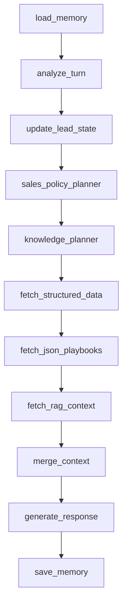

# Actual Agent Contract

Audit date: 2026-06-04  
Repo root: `/Users/miguelmoreno/Documents/MoviaVentaAgente`  
Baseline run: `/Users/miguelmoreno/Documents/MoviaVentaAgente/artifacts/evaluations/movia-eval-20260604T025630Z-4a5bf4/run.json`

This document describes what the current MovIA agent actually emits and persists. It is not a target design.

## Source Evidence

Facts in this file come from:

- `/Users/miguelmoreno/Documents/MoviaVentaAgente/src/movia_sales_agent/models/schemas.py`
- `/Users/miguelmoreno/Documents/MoviaVentaAgente/src/movia_sales_agent/agent/graph.py`
- `/Users/miguelmoreno/Documents/MoviaVentaAgente/src/movia_sales_agent/agent/planners.py`
- `/Users/miguelmoreno/Documents/MoviaVentaAgente/src/movia_sales_agent/services/openai_service.py`
- `/Users/miguelmoreno/Documents/MoviaVentaAgente/src/movia_sales_agent/services/rag.py`
- `/Users/miguelmoreno/Documents/MoviaVentaAgente/src/movia_sales_agent/whatsapp/formatting.py`
- `/Users/miguelmoreno/Documents/MoviaVentaAgente/src/movia_sales_agent/api/main.py`
- `/Users/miguelmoreno/Documents/MoviaVentaAgente/supabase/migrations/202606030001_init_movia_sales_agent.sql`
- Baseline evaluation artifacts under `/Users/miguelmoreno/Documents/MoviaVentaAgente/artifacts/evaluations/movia-eval-20260604T025630Z-4a5bf4/`

## Public Response Shape

Fact: `ChatResponse` is the API/evaluator contract. It contains:

- `response`
- `response_messages`
- `action`
- `analysis`
- `lead_state`
- `selected_action`
- `knowledge_plan`
- `retrieved_sources`
- `response_metadata`
- `token_usage`

Evidence: `ChatResponse` in `/Users/miguelmoreno/Documents/MoviaVentaAgente/src/movia_sales_agent/models/schemas.py:72-84`.

Fact: `/chat` returns this exact model, and `/webhooks/whatsapp` invokes the same agent. Evidence: `chat` and `receive_whatsapp` in `/Users/miguelmoreno/Documents/MoviaVentaAgente/src/movia_sales_agent/api/main.py:47-86`.

## LangGraph Nodes

Fact: the graph has these nodes in this order:

Evidence: `MoviaSalesAgent._build_graph` in `/Users/miguelmoreno/Documents/MoviaVentaAgente/src/movia_sales_agent/agent/graph.py:35-60`.

## Analysis Contract

Fact: `TurnAnalysis` has these fields:

- `intent: str`
- `topics: List[str]`
- `has_objection: bool`
- `objection_type: Optional[str]`
- `business_type`
- `main_channel`
- `pain`
- `urgency`
- `buying_signal`
- `wants_to_start`
- `is_post_purchase`
- `lead_updates`

Evidence: `/Users/miguelmoreno/Documents/MoviaVentaAgente/src/movia_sales_agent/models/schemas.py:34-46`.

Fact: `intent`, `topics`, `objection_type`, and `buying_signal` are not enum-constrained in the OpenAI schema. Evidence: `ANALYSIS_SCHEMA` in `/Users/miguelmoreno/Documents/MoviaVentaAgente/src/movia_sales_agent/services/openai_service.py:14-69`.

Fact: the live baseline emitted many free-form intents and topics. Example actual intent values included `request_information`, `consultar precio`, `compare_services`, and `Quiero automatizar la recepcion de tickets de compra y datos de garantia enviados por WhatsApp`. This is expected from the current schema.

Inference: because the planner relies on exact topic strings such as `platform_steps_question` and `comparison_question`, free-form topic output can prevent intended routes from firing.

## Action Contract

Fact: `SalesAction` defines this broad enum:

- `answer_and_advance`
- `discover_need`
- `narrow_solution`
- `recommend_solution`
- `persuade_value`
- `handle_objection`
- `risk_reversal`
- `compare_alternative`
- `explain_process`
- `soft_close`
- `direct_close`
- `handoff_to_miguel`
- `answer_unknown_safely`

Evidence: `/Users/miguelmoreno/Documents/MoviaVentaAgente/src/movia_sales_agent/models/schemas.py:8-22`.

Fact: the deterministic planner currently returns only a subset under normal code paths:

- `handoff_to_miguel`
- `direct_close`
- `handle_objection`
- `explain_process`
- `compare_alternative`
- `discover_need`
- `soft_close`
- `recommend_solution`

Evidence: `SalesPolicyPlanner.plan` in `/Users/miguelmoreno/Documents/MoviaVentaAgente/src/movia_sales_agent/agent/planners.py:8-67`.

Fact: in the 60-turn baseline run, the actual emitted macro actions were only:

| Macro action | Count |
|---|---:|
| `handle_objection` | 27 |
| `recommend_solution` | 19 |
| `direct_close` | 12 |
| `handoff_to_miguel` | 2 |

Evidence: baseline `run.json`.

Inference: `answer_and_advance`, `narrow_solution`, `persuade_value`, `risk_reversal`, and `answer_unknown_safely` are schema-valid but not selected by the current deterministic planner.

## Micro Action And CTA Contract

Fact: `SalesPlan.micro_action`, `cta_type`, and `objection_flow_step` are free-form strings. Evidence: `/Users/miguelmoreno/Documents/MoviaVentaAgente/src/movia_sales_agent/models/schemas.py:49-55`.

Fact: for objections, `micro_action` is assigned directly from `analysis.objection_type` or `general_objection`. Evidence: `/Users/miguelmoreno/Documents/MoviaVentaAgente/src/movia_sales_agent/agent/planners.py:30-38`.

Fact: the baseline emitted many free-form micro actions, including Spanish or English natural-language labels such as `precio alto`, `service_unavailability`, `desconfianza en la confiabilidad y soporte`, and `Repeticion de pregunta ya respondida`.

Fact: in the baseline, CTA values were:

| CTA | Count |
|---|---:|
| `objection_question` | 27 |
| `soft_close` | 19 |
| `direct_close` | 12 |
| `handoff` | 2 |

Fact: `objection_flow_step` was either `first_response` or null in the baseline:

| Flow step | Count |
|---|---:|
| `first_response` | 27 |
| null | 33 |

Evidence: `SalesPolicyPlanner.plan` in `/Users/miguelmoreno/Documents/MoviaVentaAgente/src/movia_sales_agent/agent/planners.py:8-67` and baseline `run.json`.

## Stage Contract

Fact: persisted lead stages allowed by the database are:

- `new`
- `discovery`
- `qualified`
- `recommended`
- `closing`
- `handoff`
- `unknown`

Evidence: `movia_lead_profiles_stage_check` in `/Users/miguelmoreno/Documents/MoviaVentaAgente/supabase/migrations/202606030001_init_movia_sales_agent.sql:121-124`.

Fact: API response stage is derived from the current action, not from a separate conversation stage state machine. Evidence: `_lead_state_for_response` in `/Users/miguelmoreno/Documents/MoviaVentaAgente/src/movia_sales_agent/agent/graph.py:280-294`.

Fact: persisted stage is also derived from current action when saving memory. Evidence: `_stage_for_action` in `/Users/miguelmoreno/Documents/MoviaVentaAgente/src/movia_sales_agent/agent/graph.py:234-243` and `save_memory_node` in `/Users/miguelmoreno/Documents/MoviaVentaAgente/src/movia_sales_agent/agent/graph.py:206-231`.

Fact: the baseline emitted only these stages:

| Stage | Count |
|---|---:|
| `qualified` | 27 |
| `recommended` | 19 |
| `closing` | 12 |
| `handoff` | 2 |

Inference: validation stages such as `educating`, `comparing`, `objection_handling`, `solution_recommended`, `ready_to_start`, `post_purchase`, and `unknown_recovery` are not part of the current runtime stage contract.

## Source Contract

Fact: structured fetches only support:

- `postgres.products`
- `postgres.policies`
- `postgres.official_links`

Evidence: `fetch_structured_data_node` in `/Users/miguelmoreno/Documents/MoviaVentaAgente/src/movia_sales_agent/agent/graph.py:127-136` and `STRUCTURED_SOURCE_CAPABILITIES` in `/Users/miguelmoreno/Documents/MoviaVentaAgente/src/movia_sales_agent/evaluation/capabilities.py:10-14`.

Fact: JSON sources come from config file stems loaded from `/Users/miguelmoreno/Documents/MoviaVentaAgente/docs/movia_knowledge_source/config/*.json`. The current config files are:

- `cta_rules`
- `objection_playbook`
- `platform_steps`
- `policies.seed`
- `post_purchase_handoff`
- `products.seed`
- `sales_actions`
- `source_routing_rules`
- `tone_rules`

Evidence: `load_config_bundle` in `/Users/miguelmoreno/Documents/MoviaVentaAgente/src/movia_sales_agent/config/knowledge.py:16-21`.

Fact: RAG retrieval is only attempted when `KnowledgePlan.rag_queries` is non-empty. Evidence: `fetch_rag_context_node` in `/Users/miguelmoreno/Documents/MoviaVentaAgente/src/movia_sales_agent/agent/graph.py:145-154` and `RagService.retrieve_with_usage` in `/Users/miguelmoreno/Documents/MoviaVentaAgente/src/movia_sales_agent/services/rag.py:27-81`.

Fact: baseline RAG retrieval happened on only 2 of 60 turns, both retrieving `rag_docs/use_cases/dental.md`.

Inference: labels such as `postgres.product_features`, `postgres.product_actions`, `postgres.channels`, `memory.lead_profile`, and `memory.conversation_summary` can be conceptually present in the database or memory system but are not emitted as current source labels by the agent.

## Memory Contract

Fact: memory load first upserts or finds the lead, then reads recent DB messages if a DB lead exists; otherwise it reads from `MemoryStore`. Evidence: `load_memory_node` in `/Users/miguelmoreno/Documents/MoviaVentaAgente/src/movia_sales_agent/agent/graph.py:93-104`.

Fact: `MemoryStore` uses Redis when `REDIS_URL` exists and falls back to in-memory buffers otherwise. Evidence: `/Users/miguelmoreno/Documents/MoviaVentaAgente/src/movia_sales_agent/memory/store.py:11-63`.

Fact: the response-generation context includes only the last 6 recent messages. Evidence: `build_generation_context` in `/Users/miguelmoreno/Documents/MoviaVentaAgente/src/movia_sales_agent/agent/response.py:23-46`.

Fact: `movia_conversation_summaries` exists in the database but is not used by the current graph. Evidence: table definition in `/Users/miguelmoreno/Documents/MoviaVentaAgente/supabase/migrations/202606030001_init_movia_sales_agent.sql:140-148`; no read/write node for summaries exists in `/Users/miguelmoreno/Documents/MoviaVentaAgente/src/movia_sales_agent/agent/graph.py`.

## WhatsApp Message Contract

Fact: `response_messages` is produced by `split_whatsapp_messages`. Evidence: `generate_response_node` in `/Users/miguelmoreno/Documents/MoviaVentaAgente/src/movia_sales_agent/agent/graph.py:173-204`.

Fact: splitting uses a soft limit of 520 characters and hard limit of 900 characters. Evidence: `/Users/miguelmoreno/Documents/MoviaVentaAgente/src/movia_sales_agent/whatsapp/formatting.py:6-14`.

Fact: in the baseline, 52 turns produced one WhatsApp part and 8 turns produced two parts.

## Current Baseline Summary

Fact: the full 60-turn baseline run had:

- Overall score: `0.7889`
- Hard failures: `0`
- Commercial accuracy: `1.0`
- Policy compliance: `1.0`
- Memory consistency: `1.0`
- Scope control: `1.0`
- Source selection: `0.7685`
- Objection handling: `0.5083`
- Sales progression: `0.075`
- Agent tokens: `298,453`

Evidence: `/Users/miguelmoreno/Documents/MoviaVentaAgente/artifacts/evaluations/movia-eval-20260604T025630Z-4a5bf4/summary.md` and `run.json`.
