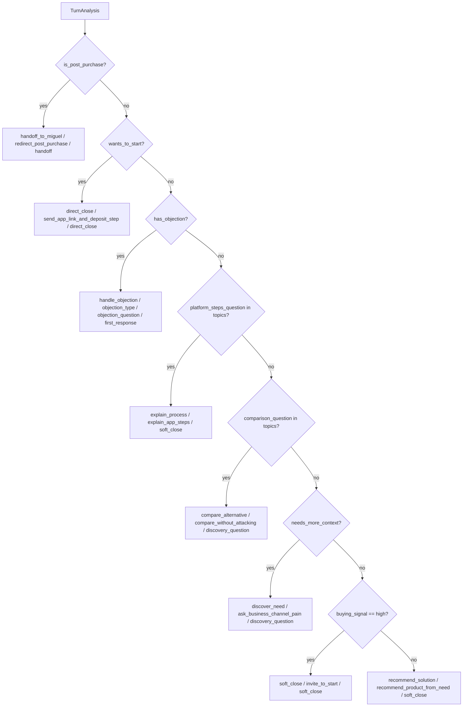

# Actual Sales Policy Flow

Audit date: 2026-06-04  
Repo root: `/Users/miguelmoreno/Documents/MoviaVentaAgente`

This document describes the current deterministic sales routing flow. It is a factual audit of the implementation, not a recommended redesign.

## Source Evidence

- `SalesPolicyPlanner.plan` in `/Users/miguelmoreno/Documents/MoviaVentaAgente/src/movia_sales_agent/agent/planners.py:8-67`
- `SalesPolicyPlanner._needs_more_context` in `/Users/miguelmoreno/Documents/MoviaVentaAgente/src/movia_sales_agent/agent/planners.py:69-86`
- `KnowledgePlanner.plan` in `/Users/miguelmoreno/Documents/MoviaVentaAgente/src/movia_sales_agent/agent/planners.py:89-126`
- `_stage_for_action` in `/Users/miguelmoreno/Documents/MoviaVentaAgente/src/movia_sales_agent/agent/graph.py:234-243`
- `_lead_state_for_response` in `/Users/miguelmoreno/Documents/MoviaVentaAgente/src/movia_sales_agent/agent/graph.py:280-294`

## Planner Priority Order

Fact: current macro-action routing is deterministic and priority ordered:

Evidence: `SalesPolicyPlanner.plan` in `/Users/miguelmoreno/Documents/MoviaVentaAgente/src/movia_sales_agent/agent/planners.py:8-67`.

## Routing Details

Fact: post-purchase turns always take priority over all other routes if `analysis.is_post_purchase` is true. They return:

- `macro_action`: `handoff_to_miguel`
- `micro_action`: `redirect_post_purchase`
- `cta_type`: `handoff`

Evidence: `/Users/miguelmoreno/Documents/MoviaVentaAgente/src/movia_sales_agent/agent/planners.py:13-20`.

Fact: `wants_to_start` takes priority over objections, topic routes, and discovery. It returns:

- `macro_action`: `direct_close`
- `micro_action`: `send_app_link_and_deposit_step`
- `cta_type`: `direct_close`

Evidence: `/Users/miguelmoreno/Documents/MoviaVentaAgente/src/movia_sales_agent/agent/planners.py:21-29`.

Fact: `has_objection` takes priority over platform steps, comparison, discovery, and recommendation. It returns:

- `macro_action`: `handle_objection`
- `micro_action`: `analysis.objection_type` or `general_objection`
- `cta_type`: `objection_question`
- `objection_flow_step`: `first_response`

Evidence: `/Users/miguelmoreno/Documents/MoviaVentaAgente/src/movia_sales_agent/agent/planners.py:30-38`.

Fact: platform and comparison routes only fire when exact topic strings are present:

- `platform_steps_question`
- `comparison_question`

Evidence: `/Users/miguelmoreno/Documents/MoviaVentaAgente/src/movia_sales_agent/agent/planners.py:39-52`.

Fact: `_needs_more_context` returns false when topics include any of:

- `pricing_question`
- `platform_steps_question`
- `industry_fit_question`
- `product_scope_question`

Evidence: `/Users/miguelmoreno/Documents/MoviaVentaAgente/src/movia_sales_agent/agent/planners.py:69-86`.

Inference: price, platform, industry-fit, and product-scope questions can skip discovery even when business/channel/pain context is missing.

## Current Stage Derivation

Fact: current stage is derived from selected action:

| Action | Stage |
|---|---|
| `handoff_to_miguel` | `handoff` |
| `direct_close`, `soft_close` | `closing` |
| `discover_need` | `discovery` |
| `recommend_solution`, `narrow_solution` | `recommended` |
| all other actions | `qualified` |

Evidence: `_stage_for_action` in `/Users/miguelmoreno/Documents/MoviaVentaAgente/src/movia_sales_agent/agent/graph.py:234-243` and `_lead_state_for_response` in `/Users/miguelmoreno/Documents/MoviaVentaAgente/src/movia_sales_agent/agent/graph.py:280-294`.

Inference: the current implementation is an action-to-stage projection, not a full sales-stage state machine.

## Knowledge Planning Flow

Fact: every knowledge plan starts with these JSON sources:

- `tone_rules`
- `cta_rules`
- `sales_actions`

Evidence: `/Users/miguelmoreno/Documents/MoviaVentaAgente/src/movia_sales_agent/agent/planners.py:91-97`.

Fact: source selection then adds sources by topic/action:

| Trigger | Added structured sources | Added JSON sources | Added RAG queries |
|---|---|---|---|
| `pricing_question` | `postgres.products` | none | none |
| `platform_steps_question` or `direct_close` or `explain_process` | `postgres.official_links` | `platform_steps` | none |
| `handle_objection` | `postgres.products` | `objection_playbook` | none |
| `handoff_to_miguel` | none | `post_purchase_handoff` | none |
| `industry_fit_question` | `postgres.products` | none | user message |
| `comparison_question` | none | `source_routing_rules` | user message |
| recommendation-like macro and no structured source | `postgres.products` | none | none |

Evidence: `KnowledgePlanner.plan` in `/Users/miguelmoreno/Documents/MoviaVentaAgente/src/movia_sales_agent/agent/planners.py:89-126`.

## Observed Baseline Flow

Fact: in the full 60-turn baseline, routing collapsed into four macro actions:

| Macro action | Count |
|---|---:|
| `handle_objection` | 27 |
| `recommend_solution` | 19 |
| `direct_close` | 12 |
| `handoff_to_miguel` | 2 |

Inference: the current analyzer frequently sets either `has_objection` or `wants_to_start`, which blocks later planner branches.

Fact: `compare_alternative`, `explain_process`, `discover_need`, and `soft_close` are implemented by the planner but did not appear in the baseline run.

Inference: the issue is not only missing enum labels; it is also analyzer-to-planner handoff. The planner is waiting for exact booleans and exact topic strings that the OpenAI analyzer does not reliably emit.

## Important Current Behavior

Fact: `buying_signal == "high"` is checked only after post-purchase, wants-to-start, objection, platform, comparison, and discovery. Evidence: `/Users/miguelmoreno/Documents/MoviaVentaAgente/src/movia_sales_agent/agent/planners.py:61-67`.

Inference: even if analysis indicates high buying signal, it will not produce `soft_close` when `wants_to_start` is true. The current order makes `direct_close` more likely than `soft_close`.

Fact: if `analysis.objection_type` is a free-form value, the planner reuses that free-form value as `micro_action`. Evidence: `/Users/miguelmoreno/Documents/MoviaVentaAgente/src/movia_sales_agent/agent/planners.py:30-38`.

Inference: this directly explains the mismatch between expected micro-action names and actual free-form micro actions in evaluation.
