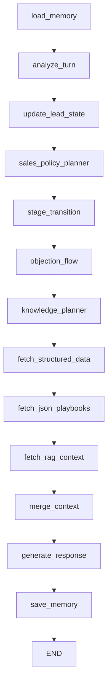

# Parallel Objection Runtime Audit

Date: 2026-06-05  
Scope: read-only audit of current runtime code and final scripted replay artifacts.  
No runtime code, tests, prompts, migrations, datasets, or thresholds were modified for this audit.

Primary sources:

- `src/movia_sales_agent/agent/graph.py`
- `src/movia_sales_agent/agent/planners.py`
- `src/movia_sales_agent/agent/objections.py`
- `src/movia_sales_agent/agent/stages.py`
- `src/movia_sales_agent/agent/response.py`
- `src/movia_sales_agent/models/schemas.py`
- `src/movia_sales_agent/db/repository.py`
- `src/movia_sales_agent/memory/store.py`
- `supabase/migrations/202606040001_stage_machine_v2.sql`
- `supabase/migrations/202606040002_active_objection_v2.sql`
- `artifacts/evaluations/movia-eval-20260605T060417Z-bef7a2/run.json`

## 1. Actual Graph Order

The LangGraph is built in `MoviaSalesAgent._build_graph()` in `src/movia_sales_agent/agent/graph.py:40-70`.



Important ordering conclusion:

- Planner selection happens before active-objection state is updated for the current turn.
- `sales_policy_planner_node()` reads `lead_profile.active_objection` loaded at the start of the graph.
- `objection_flow_node()` writes the new `active_objection` after `stage_transition_node()`.
- Therefore the planner can react to the current `analysis` and the previously persisted objection, but it does not read the `ActiveObjection` object that will be persisted later in the same graph execution.

| Node | Function | Reads | Writes |
|---|---|---|---|
| `load_memory` | `MoviaSalesAgent.load_memory()` | `channel`, `external_user_id` | `lead_id`, `lead_profile`, `recent_messages` |
| `analyze_turn` | `MoviaSalesAgent.analyze_turn()` | `message`, `recent_messages` | `analysis`, `token_usage` |
| `update_lead_state` | `MoviaSalesAgent.update_lead_state()` | `lead_id`, `analysis.lead_updates` | Repository profile fields only; no graph state keys |
| `sales_policy_planner` | `MoviaSalesAgent.sales_policy_planner_node()` | `analysis`, loaded `lead_profile.current_stage`, `previous_stage`, `active_objection`, `last_action`, `message` | `sales_plan` |
| `stage_transition` | `MoviaSalesAgent.stage_transition_node()` | loaded `lead_profile`, `analysis`, `sales_plan` | `stage_transition` |
| `objection_flow` | `MoviaSalesAgent.objection_flow_node()` | loaded `lead_profile`, `analysis`, `sales_plan`, `stage_transition`, `message` | `active_objection` |
| `knowledge_planner` | `MoviaSalesAgent.knowledge_planner_node()` | `analysis`, `sales_plan`, `message`, current-turn `active_objection` | `knowledge_plan` |
| `fetch_structured_data` | `MoviaSalesAgent.fetch_structured_data()` | `knowledge_plan.structured_sources` | `structured_context` |
| `fetch_json_playbooks` | `MoviaSalesAgent.fetch_json_playbooks()` | `knowledge_plan.json_sources`, config bundle | `json_context` |
| `fetch_rag_context` | `MoviaSalesAgent.fetch_rag_context()` | `analysis`, `knowledge_plan.rag_queries` | `rag_context`, `token_usage` |
| `merge_context` | `MoviaSalesAgent.merge_context()` | `analysis`, `sales_plan`, contexts, `recent_messages`, loaded `lead_profile`, `stage_transition`, current-turn `active_objection` | `merged_context`, `retrieval_metadata` |
| `generate_response` | `MoviaSalesAgent.generate_response()` | `message`, `analysis`, `sales_plan`, `merged_context`, settings | `response`, `response_messages`, `token_usage`, `response_metadata` |
| `save_memory` | `MoviaSalesAgent.save_memory()` | `lead_id`, `analysis`, `response`, `retrieval_metadata`, `token_usage`, `stage_transition`, `active_objection`, `sales_plan` | Repository messages, memory buffer, persisted lead profile |

## 2. Actual Graph State

The typed graph state is `AgentState` in `src/movia_sales_agent/models/schemas.py:135-156`. The commercial models are `TurnAnalysis`, `SalesPlan`, `StageTransition`, and `ActiveObjection` in the same file.

| Property | Type | Writer nodes | Reader nodes | Persistence location | Can be overwritten during one graph execution? |
|---|---|---|---|---|---|
| `current_stage` | `SalesStage` string in `lead_profile`; also `StageTransition.current_stage` | Loaded by `load_memory`; computed by `stage_transition`; persisted by `save_memory` | `sales_policy_planner`, `stage_transition`, `merge_context`, response output builder | `movia_lead_profiles.current_stage`; offline `_offline_leads[current_stage]` | The loaded `lead_profile` is not refreshed after `update_lead_state`; the final response overlays `stage_transition`. Persisted value is overwritten in `save_memory`. |
| `previous_stage` | Optional `SalesStage` string | Loaded by `load_memory`; computed by `stage_transition`; persisted by `save_memory` | `sales_policy_planner`, `stage_transition`, `merge_context` | `movia_lead_profiles.previous_stage`; offline `_offline_leads[previous_stage]` | Yes, `stage_transition` can replace it for the output and persistence. Repository only writes truthy values, so it does not clear to null. |
| `stage_before_objection` | Optional `SalesStage` string | Loaded by `load_memory`; computed by `stage_transition`; persisted by `save_memory` | `stage_transition`, `objection_flow`, `merge_context`, planner helper `_target_stage_for_objection_step()` through persisted active objection | `movia_lead_profiles.stage_before_objection`; offline `_offline_leads[stage_before_objection]` | Yes, when entering `objection_handling`. Repository only writes truthy values, so it does not clear to null. |
| `active_objection` | `ActiveObjection` object after `objection_flow`; dict in `lead_profile` before then | Loaded by `load_memory`; computed by `objection_flow`; persisted by `save_memory` | `sales_policy_planner` reads loaded value; `knowledge_planner` and `merge_context` read current-turn value | `movia_lead_profiles.active_objection` JSONB; offline `_offline_leads[active_objection]` | Yes. `objection_flow` can start, pause, replace, resolve, or clear it for the final state. |
| `analysis` | `TurnAnalysis` | `analyze_turn` | `update_lead_state`, planner, stage service, objection service, knowledge planner, merge context, response fallback, save memory | Stored on user messages as `movia_conversation_messages.analysis`; lead fields also projected into `movia_lead_profiles` | No. It is written once per turn. |
| `sales_plan` | `SalesPlan` | `sales_policy_planner` | `stage_transition`, `objection_flow`, `knowledge_planner`, `merge_context`, response fallback, save memory | Not a separate table field; persisted indirectly as `last_action` and assistant message metadata in evaluation/API response | No. It is written once per turn. |
| `stage_transition` | `StageTransition` | `stage_transition` | `objection_flow`, `merge_context`, `save_memory`, response output builder | Persisted into stage columns on lead profile | No. It is written once per turn. |
| Objection transition/result | `ActiveObjection` | `objection_flow` | `knowledge_planner`, `merge_context`, `save_memory`, response output builder | `movia_lead_profiles.active_objection` JSONB; offline dict | No after `objection_flow`; it becomes final objection state for the turn. |
| `last_action` | Macro action string in lead profile | Loaded by `load_memory`; persisted by `save_memory` from `sales_plan.macro_action` | Planner uses loaded value for soft-close logic; response lead state shows final value | `movia_lead_profiles.last_action`; offline `_offline_leads[last_action]` | The output builder overwrites displayed `last_action` with current `sales_plan.macro_action`. Persistence happens at `save_memory`. |
| Response instructions | `merged_context.commercial_instruction`, `playbook_instruction`, `response_requirements` | `merge_context` through `build_generation_context()` | `generate_response`, fallback response | Not persisted except indirectly in token metadata and evaluation artifacts | No. Built once after knowledge retrieval. |

## 3. SalesPolicyPlanner Behavior

Source: `src/movia_sales_agent/agent/planners.py`.

Current priority tree in `SalesPolicyPlanner._plan_state()`:

```python
if analysis.is_post_purchase:
    handoff_to_miguel
elif support_handoff_requested:
    handoff_to_miguel
elif has_active_objection and not should_pause_active_objection:
    if new_objection_replaces_active:
        handle_objection(first_step, new type)
    else:
        handle_objection(next_active_objection_step)
elif has_new_hard_objection:
    handle_objection(first_step)
elif explicit_start_intent and can_direct_close:
    direct_close
elif unavailable_product_plan:
    unavailable_product_plan
elif has_new_soft_objection:
    handle_objection(first_step)
elif exact_question_plan:
    answer_and_advance
elif needs_risk_reversal:
    risk_reversal
elif platform_or_onboarding_question:
    explain_process
elif competitor_comparison:
    compare_alternative
elif unknown_recovery:
    answer_unknown_safely
elif skeptical_tone:
    persuade_value
elif should_narrow_solution:
    narrow_solution
elif missing_core_discovery_key:
    discover_need
elif can_soft_close:
    soft_close
elif recommendation_plan:
    recommend_solution
elif should_persuade_value:
    persuade_value
else:
    recommend_solution(default)
```

Direct answers to planner questions:

1. Does any active objection force `handle_objection`?
   - Usually yes. `_has_active_objection()` returns true when `active=true` and `resolved=false`; it ignores `paused`.
   - It forces `handle_objection` unless `_should_pause_active_objection()` returns true for the current turn.

2. Does a paused objection still influence planner selection?
   - Yes. `paused` is not checked by `_has_active_objection()`.
   - A paused objection still blocks `_can_soft_close()` because `_can_soft_close()` requires `not _has_active_objection(state)`.
   - A hard paused objection blocks `can_direct_close()` through `_has_active_hard_objection()`.
   - On a non-pausable later turn, the planner resumes objection handling.

3. Do soft and hard objections use different routing?
   - New hard objections are checked before direct close.
   - New soft objections are checked after direct close and unavailable-product routing.
   - Once an objection is active, soft and hard both go through the same active-objection continuation branch unless pausable.

4. Can the planner select the current user intent while an objection remains active?
   - Yes, when `_should_pause_active_objection()` returns true.
   - Pausable intents are exact information intents such as pricing, scope, platform steps, onboarding, policy, channel, integration, and comparison.
   - In that case the planner can choose `answer_and_advance`, `risk_reversal`, `explain_process`, `compare_alternative`, `narrow_solution`, etc.

5. Can `answer_and_advance`, `narrow_solution`, `persuade_value`, or `recommend_solution` coexist with active objection context?
   - Yes technically. The final replay shows `answer_and_advance`, `risk_reversal`, `explain_process`, and `narrow_solution` selected while `active_objection.active=true` and `paused=true`.
   - `persuade_value` and `recommend_solution` are reachable after the pause branch if their normal conditions match.
   - However `soft_close` is explicitly blocked by `_has_active_objection()`.
   - The stage service may still reject progression out of `objection_handling`, so action coexistence does not necessarily mean stage progression.

6. What resolves an objection?
   - `ObjectionFlowService.transition()` marks an active objection resolved only when `sales_plan.macro_action == handle_objection` and the planned `objection_flow_step` is `close_or_continue` or `resolved`.
   - There is no semantic resolution classifier.

7. What allows progression after an objection?
   - Planner must produce `objection_flow_step=close_or_continue` or `resolved` while current stage is `objection_handling`.
   - `SalesStageTransitionService.transition()` then retargets to `stage_before_objection` or `previous_stage`.

## 4. ObjectionFlowService

Source: `src/movia_sales_agent/agent/objections.py`.

### State Transitions

| State/result | Condition | Result |
|---|---|---|
| Clear/no objection | `sales_plan.macro_action != handle_objection` and no current unresolved objection | Returns empty `ActiveObjection()` |
| Paused | `sales_plan.macro_action != handle_objection` and current objection is active and unresolved | Sets `current.paused = True`, returns current objection unchanged otherwise |
| Active started | Macro is `handle_objection`, `analysis.has_objection=true`, and no current active unresolved objection | Creates new `ActiveObjection(active=true, type=analysis.objection_type, strength=analysis.objection_strength, current_step=sales_plan.objection_flow_step)` |
| Superseded/replaced | Macro is `handle_objection`, current active unresolved objection exists, and `analysis.objection_type != current.type` | Returns a new `ActiveObjection`; old object is discarded. There is no persisted `superseded` status. |
| Restart same type | Macro is `handle_objection`, current active unresolved objection exists, same type, and planned step is `thank_empathize_ask_open_question` | Returns a new first-step `ActiveObjection` for the same type. |
| Active advanced | Macro is `handle_objection`, current active unresolved objection exists, and not starting/replacing | Updates `current_step`, increments `last_updated_turn`, clears `paused`, appends message evidence |
| Resolved | Active advanced and planned step is `close_or_continue` or `resolved` | Sets `resolved=true` and `active=false` |

### Step Progression

`FLOW_ORDER`:

1. `thank_empathize_ask_open_question`
2. `clarify_value`
3. `tie_solution`
4. `provide_proof`
5. `close_or_continue`

`next_objection_step()` advances by the current stored step's index:

- `none` or `resolved` -> `clarify_value`
- unknown step -> `clarify_value`
- each known step -> next item in `FLOW_ORDER`
- `close_or_continue` stays at `close_or_continue` by index clamp, but the service resolves the objection when that step is used

Direct answers:

- Does progression depend on semantic relationship between the user's answer and the previous objection question?
  - No. Progression is mainly current stored step plus current planner branch. The user message can pause or replace the objection through analysis, but it does not need to semantically answer the previous objection question to advance.

- What happens when the user asks an unrelated exact question?
  - Planner can choose the exact-question action because `_should_pause_active_objection()` returns true.
  - `ObjectionFlowService` then marks the current objection `paused=true`.
  - Stage may still remain `objection_handling` if the stage service rejects the target stage.

- What happens when `analysis.has_objection=false` but an objection remains active?
  - If current intent is pausable exact information, the objection is paused.
  - Otherwise the planner continues the active objection and advances to the next step.

- What happens when a new soft concern appears?
  - With no active objection, it starts a new soft objection after the direct-close and unavailable-product checks.
  - With an active objection of a different type, it replaces the active objection.
  - With an active objection of the same type, it usually advances the existing objection instead of restarting.

- Is there expiration or inactivity handling?
  - No. There is no TTL, turn-count expiration, inactivity expiration, or max-step age. The only end states are pause or resolution/replacement.

## 5. SalesStageTransitionService

Source: `src/movia_sales_agent/agent/stages.py`.

### Allowed Transition Table

| From | Allowed target stages from `ALLOWED_TRANSITIONS` |
|---|---|
| `new` | `discovery`, `educating`, `qualified`, `comparing`, `solution_recommended`, `unknown_recovery` |
| `discovery` | `discovery`, `educating`, `qualified`, `comparing`, `solution_recommended`, `unknown_recovery` |
| `educating` | `discovery`, `educating`, `qualified`, `comparing`, `solution_recommended`, `ready_to_start`, `unknown_recovery` |
| `comparing` | `discovery`, `educating`, `comparing`, `qualified`, `solution_recommended`, `ready_to_start`, `unknown_recovery` |
| `qualified` | `discovery`, `educating`, `comparing`, `qualified`, `solution_recommended`, `ready_to_start`, `unknown_recovery` |
| `solution_recommended` | `discovery`, `educating`, `comparing`, `solution_recommended`, `ready_to_start`, `unknown_recovery` |
| `ready_to_start` | `discovery`, `educating`, `ready_to_start`, `closing`, `unknown_recovery` |
| `closing` | `closing`, `post_purchase`, `handoff`, `unknown_recovery` |
| `post_purchase` | `post_purchase`, `handoff` |
| `handoff` | `handoff` |
| `unknown_recovery` | `unknown_recovery`, `discovery`, `educating` |

Special transition rules in `is_transition_allowed()`:

- Same-stage transition is always allowed.
- Any target `objection_handling` is allowed only when `sales_plan.macro_action == handle_objection`.
- Any transition from `objection_handling` is allowed only when `sales_plan.objection_flow_step` is `close_or_continue` or `resolved`.
- Target `closing` is allowed only when macro action is `direct_close`.
- Target `handoff` is allowed only when macro action is `handoff_to_miguel`.

Why `objection_handling -> educating` was rejected:

- In the final replay, `MOVIA-VAL-001` turn 4 selected:
  - `macro_action=answer_and_advance`
  - `target_stage=educating`
  - `objection_flow_step=none`
  - prior persisted stage was `objection_handling`
- `is_transition_allowed()` saw `current_stage == objection_handling` and required the step to be `close_or_continue` or `resolved`.
- Because the step was `none`, the service returned `current_stage=objection_handling` with `invalid_transition=objection_handling->educating`.

Does an active objection currently force persisted sales stage to remain `objection_handling`?

- Not directly by schema or by `ObjectionFlowService`.
- It happens through two cooperating behaviors:
  - Planner usually chooses `handle_objection` and targets `objection_handling` while an active objection exists and is not pausable.
  - Stage service forbids leaving `objection_handling` unless the planned objection step is `close_or_continue` or `resolved`.
- A paused active objection can coexist with non-objection macro actions, but the persisted stage can still remain `objection_handling` because the transition out is rejected.

## 6. Response Generation Interaction

Source: `src/movia_sales_agent/agent/response.py`.

When current macro action is `handle_objection`:

- `KnowledgePlanner.plan()` loads:
  - `objection_playbook:<type>`
  - `postgres.products`
  - `postgres.policies`
  - RAG only for `provide_proof`
- `build_generation_context()` includes:
  - `commercial_instruction.macro_action=handle_objection`
  - `objection_flow_step`
  - `playbook_instruction.objection`
  - `lead_context.active_objection`
- Fallback response explicitly enters `_objection_response()`.

When current macro action is not `handle_objection` but active objection remains active or paused:

- `ObjectionFlowService` returns the current active objection with `paused=true`.
- `KnowledgePlanner.plan()` does not load the objection playbook because the macro action is not `handle_objection`.
- `build_generation_context()` still includes `lead_context.active_objection` if `active=true` and `resolved=false`.
- The compact lead context includes type, strength, current step, and stage before objection, but not `paused`, evidence, turn counters, or resolution metadata.
- CTA is not overridden by the active objection; it comes from `sales_plan.cta_type`.
- The generator is instructed through `commercial_instruction` to follow the selected current macro action, not explicitly to continue the objection.

Practical effect:

- The model can answer the current exact question while seeing that there is still active objection context.
- It is not given the objection playbook unless the planner chooses `handle_objection`.
- The persisted stage may still say `objection_handling`, which can conflict with a non-objection action such as `answer_and_advance`.

## 7. Persistence

### DB Mode

Repository source: `src/movia_sales_agent/db/repository.py`.

Fields and methods:

- `current_stage`
  - Created initially in `202606030001_init_movia_sales_agent.sql`.
  - V2 values and stage timestamps added in `202606040001_stage_machine_v2.sql`.
  - Loaded by `upsert_lead()`.
  - Updated by `update_lead_profile(current_stage=...)`.

- `previous_stage`
  - Added by `202606040001_stage_machine_v2.sql`.
  - Updated only when truthy.

- `stage_before_objection`
  - Added by `202606040001_stage_machine_v2.sql`.
  - Updated only when truthy.

- `active_objection`
  - Added by `202606040002_active_objection_v2.sql`.
  - JSONB object with GIN index when non-empty.
  - Updated whenever `active_objection is not None`.

- `last_action`
  - Existing column from initial migration.
  - Updated when truthy from `sales_plan.macro_action`.

DB mode caveat:

- The current remote DB used for smoke replay did not have `stage_updated_at`, so DB-mode final replay is blocked until V2 migrations are applied to a safe evaluation database.

### In-Memory Evaluation Mode

When `MOVIA_DISABLE_DATABASE=true` or no `DATABASE_URL` is configured:

- `MoviaRepository.enabled` is false.
- Leads are stored in `_offline_leads[(channel, external_user_id)]`.
- `upsert_lead()` creates a full V2-shaped lead with:
  - `current_stage=new`
  - `previous_stage=None`
  - `stage_before_objection=None`
  - `stage_entered_at`
  - `stage_updated_at`
  - `active_objection={}`
  - `last_action=None`
  - `profile_data={}`
- `save_message()` is a no-op in offline repository mode.
- Recent message memory is handled by `MemoryStore`; Redis is used only if `REDIS_URL` is configured, otherwise an in-memory deque is used.

## 8. Representative Execution Traces

Trace source: `artifacts/evaluations/movia-eval-20260605T060417Z-bef7a2/run.json`.

Artifact limitation: the replay artifact stores post-turn `lead_state`, not the raw graph-local pre-node state. For `input_state.lead_profile_before_turn`, this audit uses the previous turn's persisted `lead_state` when available.

### 8.1 MOVIA-VAL-001 Turn 1

```json
{
  "input_state": {
    "current_stage": "new",
    "active_objection": {},
    "message": "Vi su anuncio. A ver, convenceme rapido: seguro es otro bot que contesta tonterias, no?"
  },
  "analysis": {
    "primary_intent": "general_info",
    "topics": ["support"],
    "skeptical_tone": true,
    "has_objection": true,
    "objection_type": "trust_objection",
    "objection_strength": "soft",
    "explicit_start_intent": false
  },
  "planner_output": {
    "macro_action": "handle_objection",
    "micro_action": "validate_and_clarify_objection",
    "cta_type": "objection_question",
    "objection_flow_step": "thank_empathize_ask_open_question",
    "target_stage": "objection_handling",
    "reason_code": "NEW_SOFT_OBJECTION"
  },
  "stage_transition": {
    "current_stage": "objection_handling",
    "previous_stage": "new",
    "stage_before_objection": "new",
    "stage_changed": true
  },
  "objection_transition": {
    "active": true,
    "type": "trust_objection",
    "strength": "soft",
    "current_step": "thank_empathize_ask_open_question",
    "resolved": false,
    "paused": false
  },
  "final_state": {
    "current_stage": "objection_handling",
    "last_action": "handle_objection"
  },
  "response_instruction": {
    "macro_action": "handle_objection",
    "objection_playbook_loaded": true,
    "structured_sources": ["postgres.products", "postgres.policies"]
  }
}
```

### 8.2 MOVIA-VAL-001 Turn 2

```json
{
  "input_state": {
    "current_stage": "objection_handling",
    "active_objection": {
      "type": "trust_objection",
      "current_step": "thank_empathize_ask_open_question"
    },
    "message": "Clinica dental. Pero no me digas que va a vender brackets solito."
  },
  "analysis": {
    "primary_intent": "product_scope_question",
    "topics": ["product_scope", "business_fit", "industry_use_case"],
    "skeptical_tone": true,
    "has_objection": true,
    "objection_type": "scope_objection",
    "objection_strength": "soft",
    "business_type": "dental"
  },
  "planner_output": {
    "macro_action": "handle_objection",
    "objection_flow_step": "thank_empathize_ask_open_question",
    "target_stage": "objection_handling",
    "reason_code": "NEW_SOFT_OBJECTION"
  },
  "stage_transition": {
    "current_stage": "objection_handling",
    "previous_stage": "new",
    "stage_before_objection": "new",
    "stage_changed": false
  },
  "objection_transition": {
    "active": true,
    "type": "scope_objection",
    "strength": "soft",
    "current_step": "thank_empathize_ask_open_question",
    "resolved": false,
    "paused": false
  },
  "final_state": {
    "current_stage": "objection_handling",
    "last_action": "handle_objection"
  },
  "response_instruction": {
    "macro_action": "handle_objection",
    "objection_playbook_loaded": true,
    "rag_requested": true
  }
}
```

### 8.3 MOVIA-VAL-001 Turn 3

```json
{
  "input_state": {
    "current_stage": "objection_handling",
    "active_objection": {
      "type": "scope_objection",
      "current_step": "thank_empathize_ask_open_question"
    },
    "message": "De Facebook Ads a WhatsApp. La gente pregunta precio y luego desaparece."
  },
  "analysis": {
    "primary_intent": "product_recommendation_question",
    "topics": ["product_scope", "pricing", "product_recommendation"],
    "has_objection": false,
    "objection_type": "none",
    "main_channel": "facebook",
    "pain": "lead disappearance after asking price"
  },
  "planner_output": {
    "macro_action": "handle_objection",
    "micro_action": "clarify_objection_value",
    "objection_flow_step": "clarify_value",
    "target_stage": "objection_handling",
    "reason_code": "ACTIVE_OBJECTION_CONTINUATION"
  },
  "stage_transition": {
    "current_stage": "objection_handling",
    "stage_changed": false
  },
  "objection_transition": {
    "active": true,
    "type": "scope_objection",
    "current_step": "clarify_value",
    "resolved": false,
    "paused": false
  },
  "final_state": {
    "current_stage": "objection_handling",
    "last_action": "handle_objection"
  },
  "response_instruction": {
    "macro_action": "handle_objection",
    "objection_playbook_loaded": true
  }
}
```

### 8.4 MOVIA-VAL-001 Turn 4

```json
{
  "input_state": {
    "current_stage": "objection_handling",
    "active_objection": {
      "type": "scope_objection",
      "current_step": "clarify_value",
      "paused": false
    },
    "message": "Solo responder. Cuanto cuesta el chiste?"
  },
  "analysis": {
    "primary_intent": "pricing_question",
    "topics": ["pricing", "product_scope", "business_fit"],
    "has_objection": false,
    "objection_type": "none",
    "main_channel": "whatsapp",
    "pain": "leads preguntan precio y luego desaparecen"
  },
  "planner_output": {
    "macro_action": "answer_and_advance",
    "micro_action": "answer_price_then_explain_scope",
    "cta_type": "soft_question",
    "objection_flow_step": "none",
    "target_stage": "educating",
    "reason_code": "PRICE_QUESTION_WITH_DISCOVERY_GAP"
  },
  "stage_transition": {
    "current_stage": "objection_handling",
    "stage_reason": "Invalid transition normalized to objection_handling: Responder precio exacto y avanzar una pregunta de descubrimiento si falta contexto.",
    "stage_changed": false,
    "invalid_transition": "objection_handling->educating"
  },
  "objection_transition": {
    "active": true,
    "type": "scope_objection",
    "current_step": "clarify_value",
    "resolved": false,
    "paused": true
  },
  "final_state": {
    "current_stage": "objection_handling",
    "last_action": "answer_and_advance"
  },
  "response_instruction": {
    "macro_action": "answer_and_advance",
    "objection_playbook_loaded": false,
    "active_objection_in_lead_context": true
  }
}
```

### 8.5 Genuine Hard Objection: MOVIA-VAL-005 Turn 5

```json
{
  "input_state": {
    "current_stage": "objection_handling",
    "active_objection": {
      "type": "price_objection",
      "strength": "soft",
      "current_step": "tie_solution"
    },
    "message": "Dame prueba gratis sin deposito y si funciona pago."
  },
  "analysis": {
    "primary_intent": "cheapest_plan_question",
    "topics": ["pricing", "product_recommendation"],
    "has_objection": true,
    "objection_type": "wants_free_trial",
    "objection_strength": "hard",
    "buying_signal": "low",
    "explicit_start_intent": false
  },
  "planner_output": {
    "macro_action": "handle_objection",
    "micro_action": "validate_and_clarify_objection",
    "cta_type": "objection_question",
    "objection_flow_step": "thank_empathize_ask_open_question",
    "target_stage": "objection_handling",
    "reason_code": "NEW_HARD_OBJECTION"
  },
  "stage_transition": {
    "current_stage": "objection_handling",
    "previous_stage": "educating",
    "stage_before_objection": "educating",
    "stage_changed": false
  },
  "objection_transition": {
    "active": true,
    "type": "wants_free_trial",
    "strength": "hard",
    "current_step": "thank_empathize_ask_open_question",
    "resolved": false,
    "paused": false
  },
  "final_state": {
    "current_stage": "objection_handling",
    "last_action": "handle_objection"
  },
  "response_instruction": {
    "macro_action": "handle_objection",
    "objection_playbook_loaded": true,
    "structured_sources": ["postgres.products", "postgres.policies"]
  }
}
```

### 8.6 Objection Reaches Resolved: MOVIA-VAL-001 Turn 12

```json
{
  "input_state": {
    "current_stage": "objection_handling",
    "active_objection": {
      "type": "trust_objection",
      "strength": "soft",
      "current_step": "provide_proof"
    },
    "message": "Ok, si desde el mensaje 2 te dije clinica dental, no me vuelvas a preguntar eso despues."
  },
  "analysis": {
    "primary_intent": "explicit_start_request",
    "topics": ["product_scope", "platform_process", "business_fit", "industry_use_case"],
    "has_objection": true,
    "objection_type": "trust_objection",
    "objection_strength": "soft",
    "buying_signal": "explicit_start",
    "explicit_start_intent": true
  },
  "planner_output": {
    "macro_action": "handle_objection",
    "micro_action": "close_or_continue_objection",
    "cta_type": "objection_question",
    "objection_flow_step": "close_or_continue",
    "target_stage": "new",
    "reason_code": "ACTIVE_OBJECTION_CONTINUATION"
  },
  "stage_transition": {
    "current_stage": "new",
    "previous_stage": "objection_handling",
    "stage_before_objection": "new",
    "stage_changed": true
  },
  "objection_transition": {
    "active": false,
    "type": "trust_objection",
    "current_step": "close_or_continue",
    "resolved": true,
    "paused": false
  },
  "final_state": {
    "current_stage": "new",
    "last_action": "handle_objection"
  },
  "response_instruction": {
    "macro_action": "handle_objection",
    "objection_playbook_loaded": true,
    "platform_steps_loaded": true,
    "rag_requested": true
  }
}
```

## 9. Feasibility Matrix

| Option | Required changes | Benefits | Risks | Migration impact |
|---|---|---|---|---|
| Objection remains exclusive sales stage | Minimal code changes: tune planner thresholds and allowed transitions around `close_or_continue`; possibly improve semantic resolution. | Preserves current mental model and tests. Lowest schema impact. | Keeps objection state and sales stage coupled; may continue to trap exact questions in `objection_handling`. | None required beyond existing V2 migrations. |
| Objection as parallel overlay | Treat `active_objection` as independent state; allow `sales_stage` to progress while objection remains active/paused; update response instructions to expose overlay clearly. | Fits current technical capability because `sales_stage` and `active_objection` already coexist. Reduces sticky stage. | Requires careful direct-close and hard-objection gates so the agent does not sell through serious objections. | Likely no new table fields; may need semantics for `paused`, `resolved_at`, or `last_related_turn` later. |
| Objection as nested subdialogue/subgraph | Move objection handling into a dedicated LangGraph subgraph with explicit entry/exit, semantic checks, and subdialogue memory. | Stronger control over objection lifecycle and testing; easier to reason about multi-turn objection script. | More architecture weight; risk of overfitting to scripted objections; more graph complexity. | Probably no initial schema change, but could benefit from richer objection event history. |
| Hybrid: soft inline, hard persistent overlay | Route soft concerns inline through normal planner actions; persist only hard objections or repeated soft objections as overlay. | Most directly addresses current failure: soft sarcasm/scope concerns stop freezing the whole funnel. Keeps hard objections safe. | Requires reliable strength classification and migration of tests expecting every soft objection to start flow. | Existing `active_objection` JSONB can support it; no immediate table migration required. |

No final architecture is chosen in this audit.

## 10. Final Questions

1. Can `sales_stage` and `active_objection` already coexist technically?
   - Yes. They are separate fields in runtime state and persistence. The final replay has turns with `current_stage=objection_handling`, `last_action=answer_and_advance`, and `active_objection.paused=true`. The current code can represent coexistence, but stage transition policy still couples progression tightly to objection closure.

2. What exact code currently causes objection handling to override sales progression?
   - Planner override: `SalesPolicyPlanner._plan_state()` checks active objections before exact-question and normal progression branches.
   - Stage override: `is_transition_allowed()` rejects any transition out of `objection_handling` unless `objection_flow_step` is `close_or_continue` or `resolved`.
   - Soft-close block: `_can_soft_close()` requires `not _has_active_objection(state)`.

3. Can the current user intent be processed while an objection remains active?
   - Yes, for pausable exact intents. The planner can choose non-objection actions. The objection then persists with `paused=true`. The response generator is instructed by the current macro action, not the objection playbook.

4. What prevents the agent from leaving objection handling?
   - The stage service rule for `current_stage == objection_handling`.
   - Objection progression advances by step count and only exits on `close_or_continue`/`resolved`.
   - There is no semantic resolver or expiration policy.
   - `stage_before_objection` can be `new`, so resolution can return to `new` even late in a useful commercial conversation.

5. Which changes are schema changes versus planner/stage changes?
   - Schema changes: only needed if we want richer objection lifecycle fields such as `resolved_at`, `paused_reason`, `last_related_turn`, `superseded_by`, or objection history/events. Existing V2 schema already supports a basic overlay.
   - Planner/stage changes: needed to decide when soft concerns are inline, when hard objections persist, whether paused objections block soft close, and which non-objection actions can move `sales_stage` while an objection overlay remains active.
   - Response changes: needed if the generator should explicitly answer the current intent while acknowledging a paused objection, or if CTA should be conditionally constrained by hard objection overlay.

6. Would a LangGraph subgraph provide value, or would a separate state overlay be simpler?
   - A subgraph would help only if objection handling needs a distinct mini-dialogue with semantic entry/exit checks and richer event history.
   - A separate state overlay is simpler for the current failure shape because the runtime already has `active_objection` separate from `sales_plan` and `stage_transition`; the main missing piece is policy about how overlay state affects stage/action selection.

7. Which existing tests would need to change?
   - `tests/test_objection_flow.py`: current tests expect all listed objection types to start persistent flow and advance by fixed step.
   - `tests/test_stage_machine.py`: current tests encode exclusive `objection_handling` preservation and resolution behavior.
   - `tests/test_agent_policy.py`: current tests assert active-objection continuation and direct-close gates.
   - `tests/test_response_context.py`: may need assertions for overlay instructions and paused objection visibility.
   - `tests/test_evaluation.py`: may need expected trace alignment if action/stage semantics change.

8. Which new tests are required?
   - Soft concern routes inline without creating persistent active objection when classified as soft and low-risk.
   - Hard objection persists as overlay and blocks direct close until resolved.
   - Paused hard objection still constrains close CTAs but allows exact question answers.
   - Paused soft objection does not freeze `sales_stage` when current turn advances discovery or recommendation.
   - `objection_handling -> educating/qualified/solution_recommended` behavior matches the chosen architecture.
   - Response context includes explicit overlay instruction when active objection exists but macro action is not `handle_objection`.
   - Semantic resolution test: user says the concern is answered, and objection resolves without waiting for fixed step count.
   - No cross-turn reset to first objection step unless a genuinely new objection type replaces the active one.
